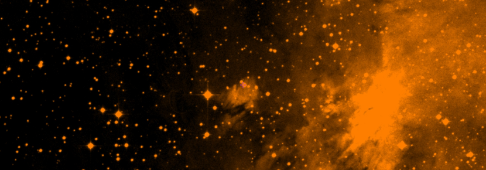

## Analysis of five embedded clusters with ASteCA.

1. Original files by Rubén
2. Processed original files to feed UBV-move, and the output.
3. Files retrieved via the `GaiaQuery` package.
4. Cross-match with 2MASS survey.
5. Cross-matched files with 2MASS, with the 2MASS colors and their
   uncertainties added via the `add_cols.py` script

The clusters were originally presented in the article [Dutra et al. (2003)](https://ui.adsabs.harvard.edu/abs/2003A%26A...400..533D/abstract):

> "*We carried out a 2MASS J, H and Ks survey of infrared star clusters in the Milky Way sector 230deg< l < 350deg. This zone was the least studied in the literature, previously including only 12 infrared clusters or stellar groups with |b|< 10deg, according to the recent catalogue by Bica et al. (2003). We concentrated efforts on embedded clusters, which are those expected in the areas of known radio and optical nebulae. The present study provides 179 new infrared clusters and stellar groups, which are interesting targets for detailed future infrared studies. The sample of catalogued infrared clusters and stellar groups in the Galaxy is now increased by 63%.*"

The Vizier tables are [here](https://ui.adsabs.harvard.edu/abs/2003yCat..34000533D/abstract). The five analyzed clusters are:

```
Name             RA_2000      DEC_2000
[DBS2003]5       07:30:04.0   -18:32:06.0 (112.5167, -18.535)
[DBS2003]60      11:05:36.6   -62:28:54.5 (166.4025, -62.4818)
[DBS2003]98      15:59:38.0   -53:45:24.0 (239.9083, -53.7567)
[DBS2003]116     17:09:34.0   -41:36:0.00 (257.3917, -41.6)
[DBS2003]117     16:59:39.0   -40:11:24.0 (254.9125, -40.19)
```

Note that the coordinates for 116 are different from those originally given by Rubén (`17:09:32.2   -41:33:23.8)`.

### Aladin views

DSS colored view of each cluster (via [Aladin](https://aladin.u-strasbg.fr)):

**DBS5**


**DBS60**


**DBS98**


**DBS116**


**DBS117**




### Analysis with 2MASS

This analysis uses 2MASS data only. These files contain about half as many stars as the Gaia DR2 data files.

For DBS5, 60, 98, the structural overdensities are clearly distinguishable over the foreground/background (field) noise. For DBS177 a more weak but still noticeable overdensity is appreciated. No clear structural overdensity can be seen for DBS116. For these two clusters (116, 117) the radius is fixed to 1 arcmin, while the remaining values are estimated by `ASteCA`.

The maximum uncertainty cuts are done at `eJ_{max}=0.1` mag, `eJH_{max}=0.2` mag, `eJK_{max}=0.2` mag, `eHK_{max}=0.2` mag. We use somewhat large maximum values to avoid losing too many stars.

The comparison with the surrounding field density shows that the number of members within each defined cluster region is:

```
Name    N_memb
--------------
DBS5    ~28
DBS60   ~13
DBS98   ~0
DBS116  ~0
DBS117  ~7
```


#### Parallax distances

The parallax analysis was performed **without cleaning the cluster region from field stars**, due to the low number of probable members in all regions. This means that the distance estimates obtained with the Bayesian method and the parallax data should be taken with care. Also, an offset of +0.029 mas was added to the parallax values, as suggested by [Lindegren et al. (2018)](https://www.aanda.org/articles/aa/abs/2018/08/aa32727-18/aa32727-18.html).

The final distance estimates (and their 16th, 84th percentiles) are:

```
Name    d_Plx (16th, 84th)
--------------------------
DBS5    3436 (3085, 3789) [pc]
DBS60   5507 (4975, 6023) [pc]
DBS98   2775 (2447, 3105) [pc]
DBS116  3073 (2581, 3563) [pc]
DBS117  1500 (1273, 1727) [pc]
```

#### Proper motions

As with the parallax analysis above, the proper motions analysis was performed **without cleaning the cluster region from field stars**.
The estimated proper motion for the cluster regions, obtained through the maximum value of the 2D KDE are:

```
Name    pmRA     pmDEC
-----------------------
DBS5    -1.723    2.292 [mas/yr]
DBS60   -2.330    1.678 [mas/yr]
DBS98   -1.414   -3.522 [mas/yr]
DBS116   0.286   -2.867 [mas/yr]
DBS117  -0.325   -1.019 [mas/yr]
```


### Analysis with Gaia DR2

The maximum uncertainty cuts are done at `eG_{max}=0.01` mag,
`eBPRP_{max}=0.2` mag.

The comparison with the surrounding field density shows that the number of members within each defined cluster region is:

```
Name    N_memb
--------------
DBS5    ~76
DBS60   ~22
DBS98   ~21
DBS116  ~0
DBS117  ~9
```


#### Parallax distances

As above, the parallax analysis was performed **without cleaning the cluster region from field stars** and using the +0.029 mas offset. The resulting values are:

```
Name    d_Plx (16th, 84th)
--------------------------
DBS5    3421 (3109, 3726) [pc]
DBS60   4871 (4472, 5280) [pc]
DBS98   2742 (2586, 2902) [pc]
DBS116  2595 (2372, 2823) [pc]
DBS117  1543 (1341, 1747) [pc]
```

#### Proper motions

Same treatment as in the 2MASS analysis. Results are:


```
Name    pmRA     pmDEC
-----------------------
DBS5    -1.719    2.302 [mas/yr]
DBS60   -2.382    1.764 [mas/yr]
DBS98   -0.149   -0.697 [mas/yr]
DBS116   0.668   -2.091 [mas/yr]
DBS117  -0.077   -0.697 [mas/yr]
```

